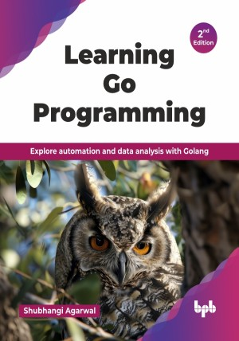

# Learning Go Programming - 2nd Edition

Explore automation and data analysis with Golang.

This is the repository for [Learning Go Programming - 2nd Edition
](https://bpbonline.com/products/learning-go-programming-2nd-edition?variant=44539419951304),published by BPB Publications.

## About the Book
Go has transformed the way developers build scalable, high-performance applications. Whether you are new to it or an experienced developer, mastering its unique idioms and best practices is crucial for writing clean, efficient, and production-ready code.

This book is a comprehensive guide to mastering Golang that begins by covering basics of Golang, with concepts like syntax, concurrency, and error handling. Further, this book discusses the key aspects of data analysis and DevOps. It introduces web scraping, machine learning, data handling and manipulation, performing Exploratory Data Analysis—all within the Golang ecosystem. For DevOps enthusiasts, this book highlights how the performance and simplicity of Golang make it a powerful tool for creating automation scripts, managing workflows, and building CI/CD pipelines. It will help you leverage Golang for both data-driven decisions and operational efficiency. You will learn how Golang can process and analyze data, complementing your toolkit. It will help you harness Golang to streamline deployment processes, build reliable tools, and automate complex workflows.

Packed with real-world examples and expert insights, this book is your ultimate resource for becoming a Go expert. Whether you are building web services, automating tasks, or diving into AI, this book will equip you with the skills to write efficient, scalable, and production-ready applications.

## What You Will Learn
• Master Golang syntax, concurrency, and error handling for efficient code.

• Write optimized, concurrent Go programs for real-world applications.

• Implement error handling and logging practices to ensure robust code.

• Create reusable, modular Golang packages for various use cases.

• Analyze and manipulate data using the Golang native libraries and tools.

• This edition introduces web scraping techniques to automate data extraction for analysis or processing.

• Covers DevOps applications like building CI/CD pipelines, and automating workflows, for operational efficiency.
